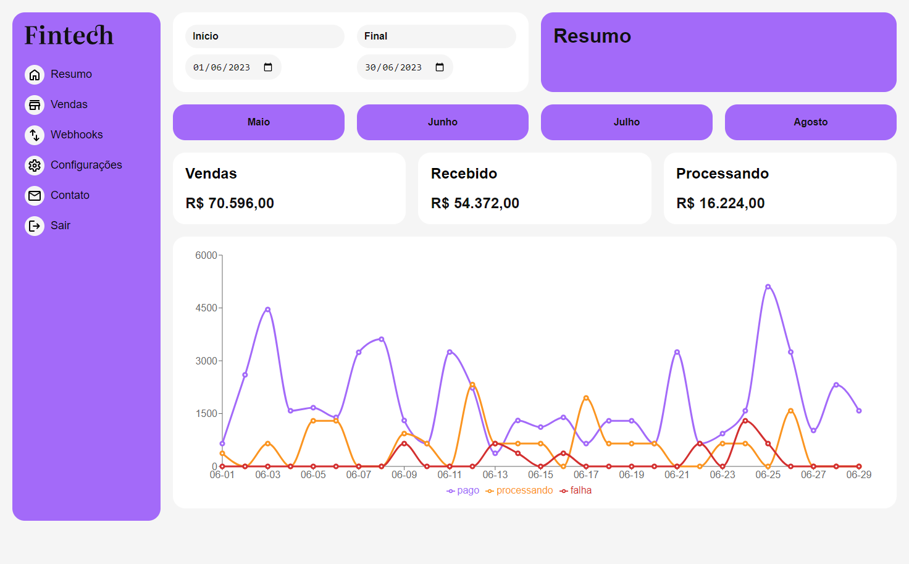
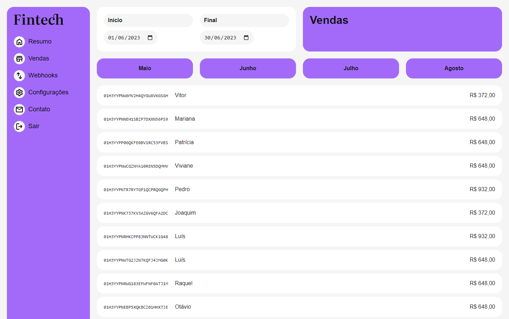
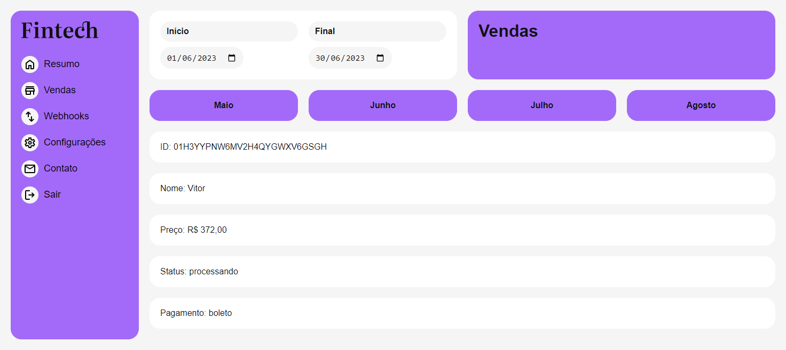

<p align='center'></p>
<h1 align='center'>Fintech</h1>
<p align='center'>


</p>

## 🔖 Descrição
<p>📋 Criação de uma dashboard utilizando uma API de vendas para colocar em prática os conhecimentos aprendidos no curso de React + TypeScript da Origamid.

## 🚀 Tecnologias
Esse projeto está utilizando as seguintes tecnologias:
- HTML
- CSS
- JavaScript
- [ViteJS](https://vitejs.dev/)
- [Recharts](https://recharts.org/en-US/)

## 🎲 Como utilizar
```bash
# Clone esse repositório
$ git clone https://github.com/rafaasimi/react-typescript-origamid.git

# Navegue até o repositório
$ cd fintech

# Instale as dependências
$ npm install

# Execute a aplicação
$ npm run dev
```
<h3>🖼 Layout</h3>




---
<p>Criado com 💙 por <a href='https://github.com/rafaasimi/' target='_blank'>Rafael Simionato</a></p>